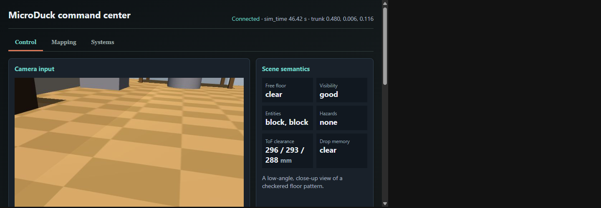

# MicroDuck Remote Brain

Deterministic planning and verification layer for a simulated or physical
MicroDuck. The brain sends high-level intents to `robotd`; it never accesses
motors or `RemoteIo` directly.



[Watch the command-center tour](docs/media/command-center-tour.mp4) or read the
[command-center guide](docs/COMMAND_CENTER.md) for an explanation of each view.

The first supported path is deliberately small:

```text
typed walk plan -> deterministic gates -> robotd IPC -> RemoteIo -> MuJoCo
                <- robot.state evidence <-          <- simulator oracle
```

## Installation

See [docs/INSTALL.md](docs/INSTALL.md) for supported prerequisites, the
PowerShell and shell installers, optional voice dependencies, and release
hygiene. The shortest development setup is:

```bash
./scripts/install.sh
uv run pytest
```

On Windows PowerShell, use `.\scripts\install.ps1` followed by
`uv run pytest`. Add `--voice` or `-Voice` only when microphone capture is
needed.

## Documentation

| Guide | Scope |
| --- | --- |
| [Installation](docs/INSTALL.md) | Prerequisites, installers, optional voice dependencies, and release hygiene. |
| [Windows and WSL](docs/WINDOWS_WSL.md) | Complete Windows, WSL2, Docker, GPU, and local-stack workflow. |
| [Architecture](docs/ARCHITECTURE.md) | Provider boundaries, stable contracts, safety, and failure behavior. |
| [Autonomy](docs/AUTONOMY.md) | Observe/decide/act loop, deterministic recovery, ownership, and telemetry states. |
| [Persona models](docs/PERSONA_MODELS.md) | Scene and action schemas, prompts, model selection, and deterministic resolution. |
| [Navigation](docs/NAVIGATION.md) | Target-control boundary, odometry, persistent mapping, and startup localization. |
| [Command center](docs/COMMAND_CENTER.md) | Real-stack launch, screenshots, controls, mapping status, and system diagnostics. |
| [Deferred work](docs/TODO.md) | Security, physical safety, operations, media, and navigation work not yet delivered. |

## Standalone contract simulation

The repository includes a dependency-free protocol simulator and a Docker Compose stack. It emulates
the external `robotd`, body, ToF, IMU and camera contracts without requiring the Rust or MuJoCo
repositories:

```powershell
.\scripts\standalone-stack.ps1 start
Start-Process http://localhost:8780
.\scripts\standalone-stack.ps1 stop
```

This is intended for repeatable integration and migration testing. Use the full local simulation
below when MuJoCo physics, the production policy and WSLg rendering are required.

## M1 execution

```bash
microduck-brain plan.json \
    --robot-socket /run/microduck/robotd.sock \
    --simulator-host 127.0.0.1 \
    --simulator-port 7801 \
    --minimum-displacement 0.02 \
    --trace execution.jsonl
```

The simulator arguments are optional. `--minimum-displacement` requires them
and verifies trunk XY displacement after each walk. The TCP BodyOracle is
read-only and is never a robot command path.

### Wire contracts

The robotd transport is newline-delimited JSON-RPC 2.0 over a Unix stream
socket. It sends `robot.subscribe` requests with `{ "hz": 10.0 }`,
`robot.move` notifications with `vx`, `vy` and `vyaw`, and
`robot.stop` requests. Request results must contain `{ "accepted": true }`.
`robot.state` notifications must report finite applied velocity as
`move.applied = [vx, vy, vyaw]`.

The simulator transport is newline-delimited JSON over TCP. Protocol 1 starts
with `{ "op": "hello", "protocol": 1, "joints": 15 }`, which receives
`{ "protocol": 1 }`. An `{ "op": "read" }` request receives
`{ "trunk": [x, y, z], "sim_time": ... }`. All numeric values must be finite.

## Complete local simulation

Run the complete stack from PowerShell:

```powershell
.\scripts\local-stack.ps1
```

The script starts components in this order:

1. the Ollama service on the Windows PC;
2. the visual `microduck_rl` apartment world under WSLg;
3. the production `robotd` runtime connected to MuJoCo through `RemoteIo`;
4. simulated ToF and the duck voice bank through WSLg PulseAudio;
5. a TCP gateway on `127.0.0.1:8765` representing the Wi-Fi hop;
6. the Windows-hosted MuJoCo telemetry dashboard on `0.0.0.0:8780`, reading
    the WSL simulator through localhost and adding a Windows Firewall rule for private networks;
7. the autonomous camera/personality loop, enabled for bounded MuJoCo movement;
8. the Windows push-to-talk loop, Whisper.cpp, Ollama planning, gates, and actions.

The telemetry dashboard is reachable from another PC at the Ethernet IPv4
address printed by the launcher, for example `http://<lan-ip>:8780`. It reads
the live MuJoCo protocol and displays joint positions and velocities, currents,
trunk pose, simulation time, IMU gravity/gyro/quaternion, nominal voltage and
temperatures, plus the simulated VL53L5CX 8x8 ToF frame. Both PCs must be on the
same private network. The native MuJoCo window remains local to the
Windows/WSLg session; it is not a network video stream.

The screenshots and short video in the [command-center guide](docs/COMMAND_CENTER.md) were captured
from this complete stack, not from the standalone contract simulator. The guide also explains the
Control, Mapping, and Systems views and identifies which mapping features are disabled by default.

The MuJoCo viewer is synchronized at 50 Hz. Its `head_camera` is rendered at 640x480 and 30 fps,
and the telemetry MJPEG stream is scheduled at 30 Hz. The autonomous simulation
profile and dashboard both consume this camera; the PC webcam is not used by that profile. The
dashboard exposes it as MJPEG at `/api/camera/stream` and as a single JPEG at
`/api/camera.jpg`. Rendering uses a private MuJoCo state copy so camera work
does not hold the physics lock or reduce `robotd`'s 50 Hz control rate. This
MJPEG transport is for local simulation; the physical MicroDuck is expected to
use the hardware H.264/WebRTC path provided by `mediad`.

The controller mapping matches `padd`:

| Control | Simulated MicroDuck action |
| --- | --- |
| Left stick | Forward/backward and lateral motion |
| Right stick X | Turn |
| Start | Enable or disable the policy |
| Y | Toggle head mode; both sticks pose the head |
| B | Toggle body-pose mode; sticks lean and crouch |
| A | Ground pick |
| X | Roulade; hold to chain |
| LB / RB | Left / right kick |
| D-pad down | Sit / stand |
| D-pad up, hold 3 seconds | Switch walk / roller mode |
| RT | Open mouth and chirp on press |
| LT | Open mouth and hold the wheee sound |
| Back / Select, hold 2 seconds | Sit and shut down |
| Right stick press | Push-to-talk start/stop, added by the remote-brain stack |
| D-pad left / right | Unassigned |
| Left stick press | Unassigned |

The LAN telemetry page is also a simulation command center. It exposes bounded drive, gaze, head
and body control, every installed skill and sound, walk/roller mode, theremin and chorale. Manual
control explicitly pauses the persona; **Resume persona** returns ownership. This HTTP control
surface is enabled only by the local simulation launcher and has no authentication, so it must not
be exposed outside a trusted development LAN.

**Disable all actions** is a separate persistent safety latch. It immediately sends `robot.stop`,
pauses autonomous actions, and rejects every dashboard command except another stop. **Enable all
actions** must be selected explicitly to clear the latch. Restarting the local stack does not clear
it.

Autonomy combines the semantic camera scene with the simulated 8x8 ToF frame. The two lowest ToF
rows are treated as the floor-continuity band for the approximately 20 cm-high robot. A majority of
missing returns or ranges beyond 700 mm in a left, center, or right sector marks a possible stair or
drop-off. That hazard remains latched until three consecutive fully safe observations, preventing a
turn from immediately erasing knowledge of a void that moved out of view. While latched, forward
motion and object skills are forbidden; MicroDuck may only inspect a safe side or stop.

Outside a remembered drop hazard, MicroDuck behaves as an active domestic animal. A three-behavior
activity window requires at least two physical choices, selected from forward walking, curved
wandering, inspection turns, and small-object interactions. Ordinary visual uncertainty is tolerated
when current ToF clearance supports movement. The resolver uses only relative scene and depth facts,
so the same policy applies to other simulator scenes without a map-specific route.

Each completed autonomous cycle also enters a short episodic memory containing the semantic scene,
camera axis, ToF summary, selected action, and execution outcome. Its serialized snapshot is prepared
in a background worker while the robot acts or waits between cycles. The persona compares those
episodes with the current scene instead of receiving only action names. Memory length is variable:
the model releases a completed local exploration thread when its older details are no longer useful,
while a hard episode limit and a budget derived from 20% of the Ollama context window prevent prompt
growth. Failed translations remain in memory as stalled outcomes.

If MicroDuck approaches a centered nearby point of interest and that entity disappears from the next
good semantic scene, the memory layer treats it as a likely close-range arrival. It bypasses another
approach decision and performs one bounded in-place half-turn toward the safer ToF side, then releases
the completed exploration thread. Remembered drops and insufficient side clearance still block this
recovery through the same actuator safety checks as ordinary turns.

Robot mode and loaded skill policies are refreshed every cycle. Walk mode may occasionally add
sit/stand; an autonomous sit is paired with a deterministic stand before the next camera capture.
Kicks are offered only for a nearby detected ball with the matching policy. Roulade remains a manual
action until map-based return-to-anchor control is complete.
Roller mode removes leg-dependent kicks, roulade, and sit/stand while retaining mode-specific
locomotion and roller crouch when advertised. Autonomy never selects roller mode without an external
capability proving that rollers are installed. A bounded three-note sound phrase provides solo
singing; native chorale remains an explicit multi-duck opt-in.

When visual context is insufficient, MicroDuck stops its body and scans only its head left, right,
up, down toward the nearby floor, then center through `robot.look`. These vertical views improve
context for a camera only about 20 cm above the floor. The acquisition sequence remains subordinate
to remembered-drop safety and the global action-disable latch.

An unusable camera frame or invalid semantic scene triggers the same scan directly, before persona
planning. MicroDuck therefore changes its viewpoint instead of remaining degraded and retrying an
identical image. The invalid scene is never supplied to the action model.

A valid scene also receives the proactive five-view scan after five behaviors without head
acquisition, keeping object and person recognition spatially current. Semantic entity bearings are
relative to the current camera axis. An interest discovered while the head is turned left or right
therefore forces the next safe exploration step to advance on a matching left or right curve instead
of treating the center of that image as straight ahead of the body.

If all three head views remain unusable, MicroDuck rotates its body toward the safer ToF sector and
starts a new acquisition. It no longer repeats the same head scan indefinitely from one trunk pose.

After the center scan, the next safe action must move the body. Tight-space exploration prefers an
in-place turn instead of repeatedly requesting ineffective reverse motion. The small robot may
advance from 280 mm center clearance; drop and stair safety remain independent. Failed translations
are temporarily removed from the action vocabulary so the next cycle tries a different strategy.
After two consecutive turns or scans, safe translational actions are forced when available.

When experimental mapping is enabled, scripted skills capture their starting X/Y/yaw pose for the
occupancy-map navigation layer. Exploration keeps a reachable free/unknown frontier as a persistent
goal, plans through known free cells with robot-radius obstacle inflation, and turns or advances from
the current aligned map pose. Fresh ToF drop and clearance evidence can always override that global
path. Mapping is disabled in the default profiles while localization and map quality remain under
validation. Autonomous roulade is paused until deterministic return-to-anchor navigation is
complete; manual roulade remains available.

The gamepad client starts with the local stack and waits safely if the pad is
asleep. A disconnect sends `robot.stop`; `robotd`'s deadman remains the final
fallback. When no active gamepad slot is available for push-to-talk, the
launcher uses Enter as the voice trigger.

If the launcher reports that the controller is paired without an input stream,
press the Xbox button until it remains steadily lit and run `joy.cpl`. If the
controller does not appear there, remove and pair it again in Windows Bluetooth
settings. The gamepad client polls continuously and does not need a restart
after the controller becomes available.

The microphone can be selected with `-Microphone`, using a SoundDevice index
or device name. No machine-specific device is assumed by the project.

Useful commands:

```powershell
.\scripts\local-stack.ps1 -NoVoice
.\scripts\local-stack.ps1 -NoVoice -NoAutonomy
.\scripts\local-stack.ps1 -Action status
.\scripts\local-stack.ps1 -Action text -Text "Walk forward for four seconds"
.\scripts\local-stack.ps1 -Action stop
```

The launcher does not require activating the Python virtual environment
manually. Use `-TelemetryPort` when port `8780` is already occupied.
`-NoVoice` keeps the autonomous personality running; use `-NoAutonomy` only when a fully manual
simulation is required. Voice, autonomous actions and gamepad commands use separate activity files
so they do not command the robot simultaneously. The telemetry dashboard's **Autonomous persona**
section shows each live observe/decide/act cycle and the last completed behavior.

The TCP gateway is intentionally simulation-only and has no authentication. It
creates a real network boundary on one PC without pretending to implement RF.
The physical deployment will replace this gateway with the project's remote
Wi-Fi/WebRTC transport while keeping the plan, gates, and `robotd` intents.

Scenario files live in the `microduck_rl` worktree. The default launcher scene
is `apartment`; pass `-Scene` to select another `scene_<name>.xml` world.

### Mouse interaction

Enable **Mouse interaction** in the `MicroDuck Simulation Controls` window. The
mode preselects the duck's trunk and gates all mouse-applied forces. When the
box is cleared, pending mouse forces are removed and dragging controls only the
camera. The applied wrench lets the duck be lifted, pushed, turned, dropped,
and allowed to recover naturally.

| Mouse gesture | Effect |
| --- | --- |
| `Ctrl` + left drag | Rotate the selected body |
| `Ctrl` + right drag | Move it in the vertical plane |
| `Ctrl` + `Shift` + right drag | Move it in the horizontal plane |
| Drag without `Ctrl` | Move the camera |
