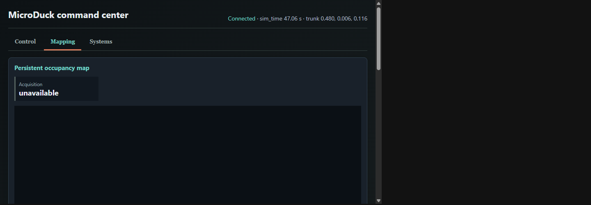
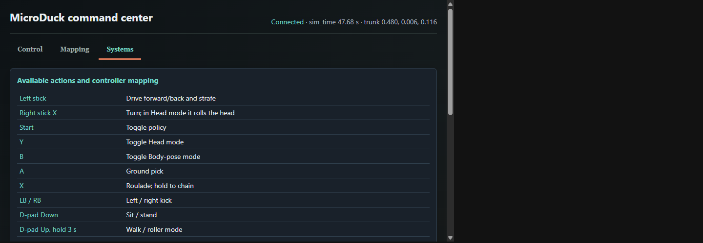

# Command center

The command center is the browser interface for the complete local MicroDuck stack. It combines the
MuJoCo head camera, semantic perception, autonomous-persona state, bounded manual controls, ToF,
and robot diagnostics. The screenshots and video below were captured from the real
`local-stack.ps1` workflow with MuJoCo, `robotd`, the TCP gateway, telemetry, and autonomy running;
they do not use the standalone contract simulator.

[Watch the 9-second command-center tour](media/command-center-tour.mp4)

## Start the complete stack

From PowerShell:

```powershell
.\scripts\local-stack.ps1 -NoVoice
```

This keeps autonomous perception and actions enabled while omitting only push-to-talk microphone
capture. Open <http://localhost:8780> on the host or use the private-LAN URL printed by the launcher.
Confirm that the header says **Connected** and that `sim_time` is increasing before relying on the
data. A complete health check is available with:

```powershell
.\scripts\local-stack.ps1 -Action status -NoVoice
```

The expected result reports a healthy robot, a 50 Hz control loop, an operational bus and IMU, a
world running close to real time, and reachable gateway, telemetry, and Ollama services.

## Control


The **Control** view is the operating surface:

| Panel | Meaning |
| --- | --- |
| Camera input | Live 640x480 `head_camera` image rendered by MuJoCo. This is the same robot viewpoint consumed by autonomous perception. |
| Scene semantics | Latest structured vision result: floor state, visibility, detected entities, hazards, left/center/right ToF clearance, and remembered drop state. |
| Autonomous persona | Current observe/decide/act phase, resolved behavior, voice, data age, and the model's short explanation. |
| Command center | Bounded manual drive, gaze, skills, sounds, locomotion mode, theremin, chorale, stop, relax, and shutdown controls. |

The persona owns the robot by default. **Manual control** pauses autonomous ownership before a
human command is sent; **Resume persona** returns ownership. **Disable all actions** is a separate,
persistent safety latch: it stops motion and rejects subsequent dashboard actions until explicitly
re-enabled. The normal `robotd` deadman and safety gates remain active underneath this interface.

Do not expose this page outside a trusted private development LAN. The current simulation command
surface has no authentication or TLS.

## Mapping



The **Mapping** view has two independent data products:

| Panel | Meaning |
| --- | --- |
| Persistent occupancy map | Experimental free/occupied/unknown grid, acquisition freshness, scan age, cell counts, coverage, pose source, and estimated duck pose. |
| ToF / lidar 8x8 | Live VL53L5CX-style depth frame. Each cell is one range zone in millimetres; the color scale makes near and far returns easy to compare. |

The default simulation profile deliberately has `mapping.enabled = false`, and the standard launcher
does not provide map and localization files to the telemetry process. The map therefore reports
**unavailable** in a normal run, as the real-stack screenshot shows. This is not a telemetry failure:
the ToF frame remains live, and autonomy still uses its bounded clearance and remembered-drop safety
logic. Persistent mapping stays experimental until startup localization and map quality meet the
criteria in [Navigation](NAVIGATION.md) and [Deferred work](TODO.md).

When mapping is enabled in a development profile, the autonomous worker must publish the occupancy
map and localization record, and the telemetry server must receive their paths through `--map-file`
and `--localization-file`. A map must not be presented as active if either side is missing.

## Systems



The **Systems** view is for control reference and low-level diagnosis:

| Panel | Meaning |
| --- | --- |
| Available actions and controller mapping | Current browser/gamepad bindings, including policy toggle, head and body-pose modes, skills, sound controls, and shutdown hold. |
| Robot state | Trunk height, nominal voltage, base velocity, and maximum reported actuator temperature. |
| IMU | Gravity vector, angular velocity, and orientation quaternion from the active simulator IMU contract. |
| Joints | Fifteen measured joint positions in radians. Changing values confirm that live state is reaching the dashboard. |

Use this view to distinguish presentation or autonomy issues from lower-level state problems. A
connected dashboard with frozen `sim_time`, implausible gravity, or unchanged joints during commanded
motion should be treated as stale or unhealthy even if the page itself still loads.

## Data boundaries

The dashboard is a monitor and high-level command client, not a motor driver. Commands are sent to
`robotd` through the simulation TCP gateway, while camera and body telemetry come from the MuJoCo
protocol. The physical robot is expected to replace the simulation camera path with the authenticated
`mediad` H.264/WebRTC path; the current browser command surface is not a production remote-control
transport.
